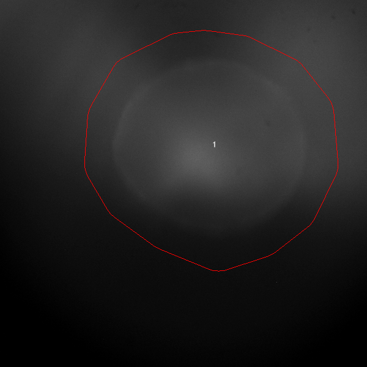

# miniscope_fullstack

point the repository to your miniscope files; run the code; get detailed plots and analyses of the mechanical and calcium fluorescence patterns

How to run:
python -m pip install -r requirements.txt
python main.py

python main.py will do the following:
1) run trace_extraction, which will give you the peak plots + ROIs annotated on the first frame for verification
1) Provide metrics (e.g. frequency of beating , irregularity, decay90, etc.) from the data 
1) Creative comparative plots for different drug concentrations and types with the organoids.

Output files that look like this:

(This is our negative control: shows what a regular commercially-paced organoid will provide as its fluorescent transient peaks.)
From input files that look like this:

* Will update with comparative fluorescence patterns for three different drugs and normal soon

Main to-dos:
* add mechanical contractility modules
